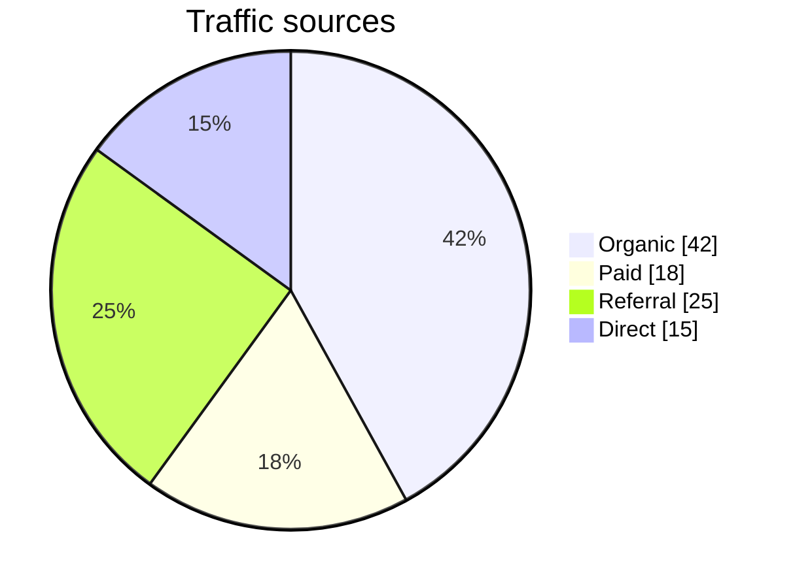
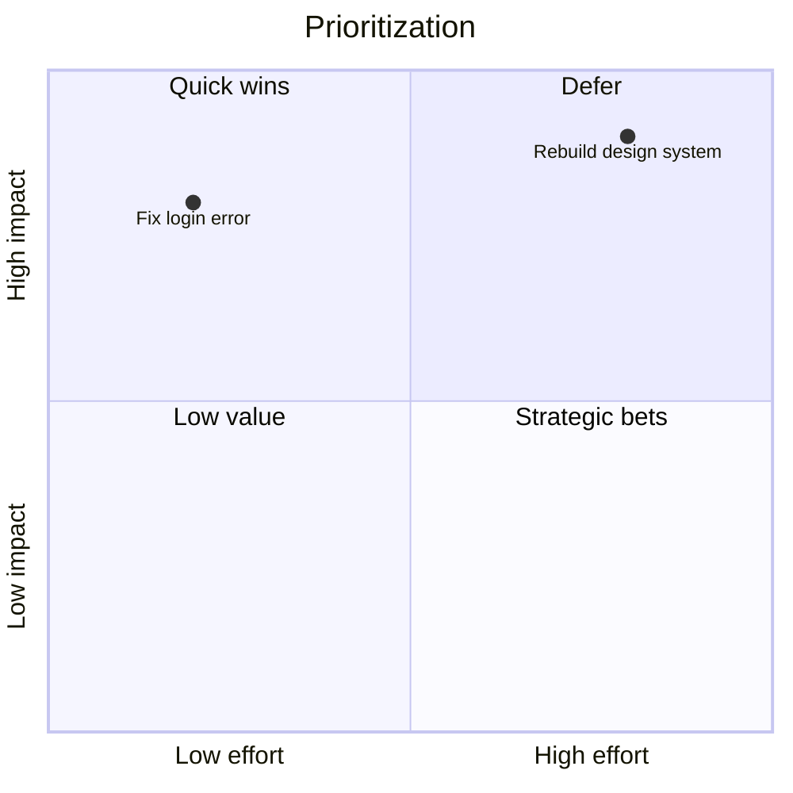
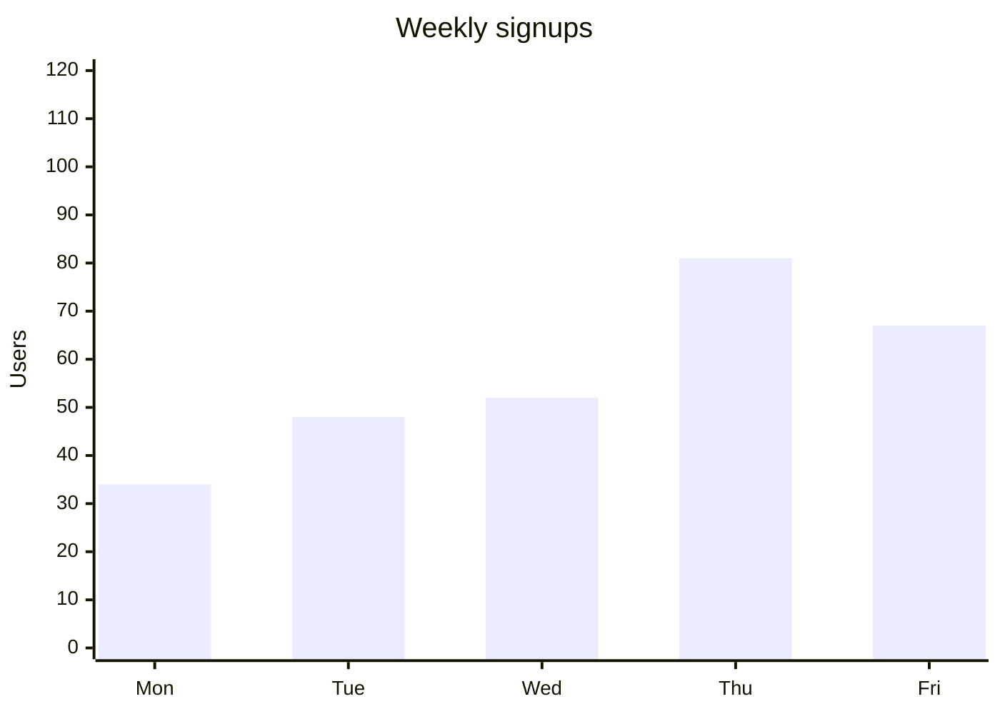
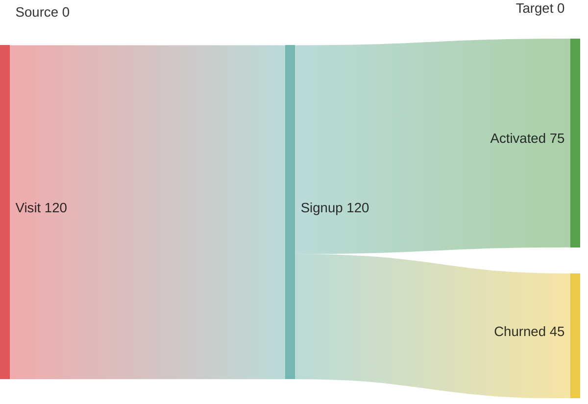
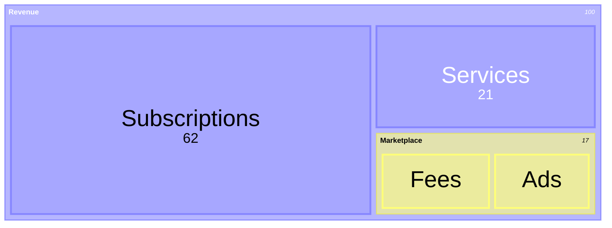
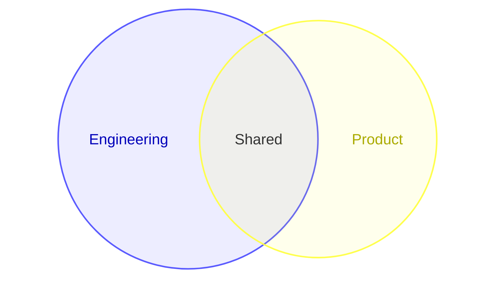

# Chart And Analysis Diagrams

Use these diagrams for comparison, prioritization, proportions, overlap, and weighted movement.

## Pie

Use for a small number of part-to-whole slices.

Avoid when there are many categories or close values.

## Quadrant Chart

Use for positioning a few named items on two dimensions such as impact vs effort.

## XY Chart

Use for line/bar series across categories or numeric ranges.

Choose this over quadrant when the points form a series or measurement set.

## Radar

Use for profile comparison across multiple dimensions.

Use sparingly; values should be comparable on the same scale.

## Sankey

Use for weighted flow from sources to targets.

Because syntax is CSV-like, keep labels clean and quote commas if needed.

## Treemap

Use for hierarchical proportions.

Choose this over pie when categories are nested.

## Venn

Use for set overlap.

## Common Mistakes

- Using pie with too many slices
- Using quadrant for measured series
- Using radar for incomparable metrics
- Using sankey when the links are not weighted
- Using treemap without natural hierarchy
