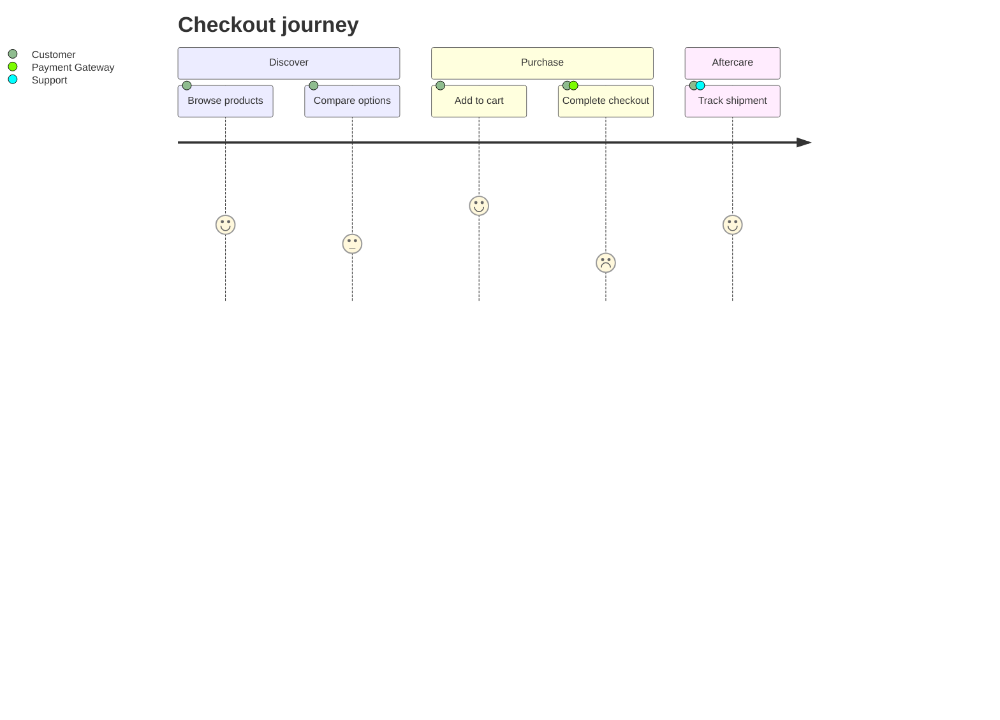
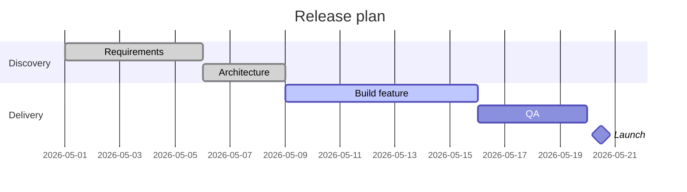
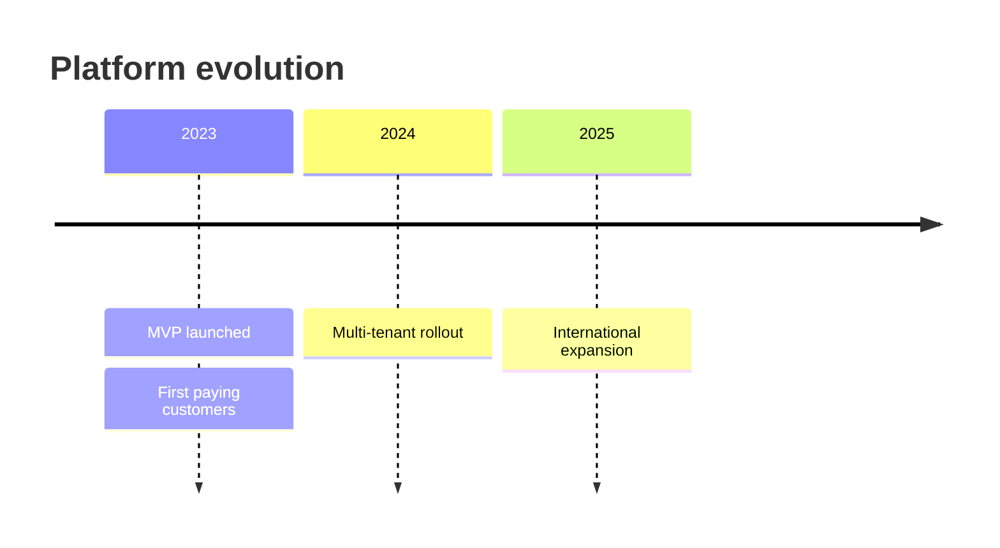
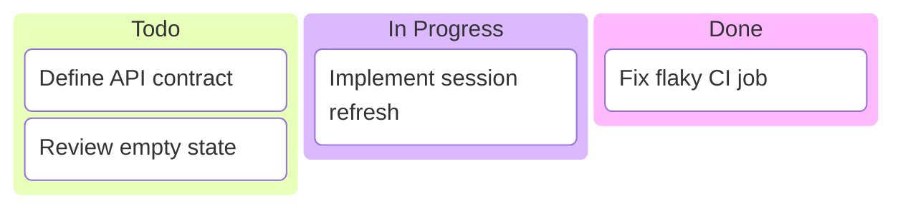

# Planning And Tracking Diagrams

Use these diagrams for planning, progress, chronology, and user experience over time.

## User Journey

Use for stages in an experience, actor touchpoints, and emotional/satisfaction scoring.

Choose this over flowchart when the question is about experience quality, not system logic.

## Gantt

Use for dated plans, milestones, dependencies, and delivery schedules.

Choose this over timeline when duration and dependency matter.

## Timeline

Use for chronology without task scheduling detail.

Choose this over gantt when you only need ordered events.

## Kanban

Use for work states and in-flight items rather than dates.

Choose this over gantt when throughput and status matter more than schedule.

## Common Mistakes

- Using gantt for unscheduled brainstorming
- Using timeline for dependency-heavy plans
- Using kanban for strict date commitments
- Using user journey to model backend control flow
