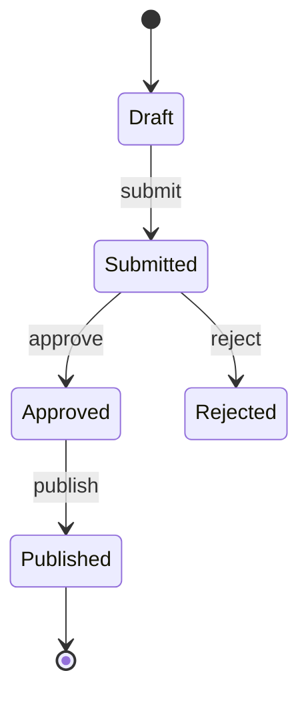
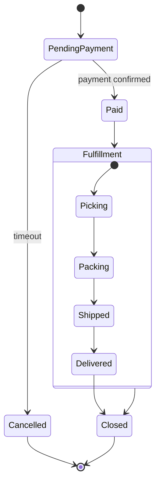

# State And Lifecycle Diagrams

Use state diagrams for lifecycle rules: what states exist, what transitions are valid, and what events move the system between them.

## Use It For

- Order, ticket, account, workflow, and job lifecycle
- UI modes and screen states
- Device or protocol state machines
- Concurrency and fork/join transitions

## Avoid It For

- Step-by-step task execution with many actors
- Simple business process flows without persistent state

## Core Syntax

Prefer `stateDiagram-v2`:

## Useful Features

- `[*]` for start/end
- `A --> B: event`
- `state X { ... }` for composite states
- `state C <<choice>>` for guarded branching
- `state F <<fork>>` and `state J <<join>>` for concurrency
- `note right of X` for rules or invariants

## Example

## Choose State Diagram Instead Of

- **Flowchart** when state persistence matters.
- **Sequence diagram** when legal transitions matter more than participant messaging.

## Common Mistakes

- Modeling every tiny sub-step as a state
- Using states for one-off actions instead of durable conditions
- Ignoring invalid or terminal states
