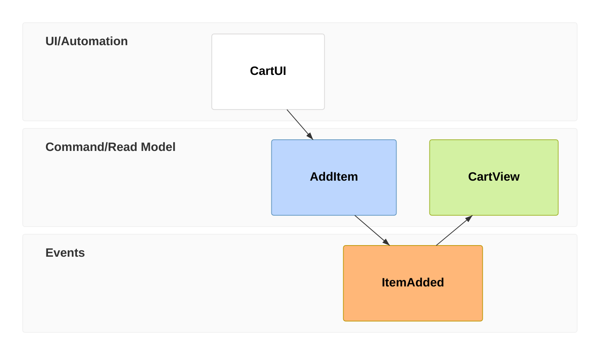

# Strategy And Event Diagrams

Use these diagrams when the question is neither plain process flow nor plain architecture.

## Event Modeling

Use for event-sourced or domain-event narratives that show how information changes over time across UI, commands, read models, and events.

### Use It For

- Event-sourced systems
- Domain event discovery
- Read-model and command separation
- Explaining business flow through facts that happened

### Avoid It For

- Simple request/response API walkthroughs
- Stateless workflow diagrams
- General infrastructure maps

### Core Syntax

Compact and relaxed forms are both supported. Time frames are the backbone of the diagram and are identified by unique numbers.

### Entity Types

- `ui` for user interface
- `pcr` or `processor` for automation/processor
- `cmd` or `command` for commands
- `rmo` or `readmodel` for read models
- `evt` or `event` for events

### Example Use

Use Event Modeling instead of sequence diagrams when the primary story is:
"what facts happened, what command caused them, and what view changed".

## Wardley Maps

Use for strategic positioning of components by user visibility and market evolution.

### Use It For

- Build vs buy conversations
- Strategic platform decisions
- Mapping value chain dependencies
- Showing how components evolve from novel to commodity

### Avoid It For

- Runtime architecture
- Message flow or lifecycle behavior
- Detailed engineering design

### Key Rules

- Wardley maps use `wardley-beta`.
- Coordinates use `[visibility, evolution]`, not standard `(x, y)` order.
- Visibility is vertical value delivered to users.
- Evolution is horizontal maturity from genesis to commodity.

### Minimal Guidance

Start with a small set of components:

- one or two user anchors
- a few visible capabilities
- supporting components beneath them
- dependencies only where strategically meaningful

Because the syntax is newer and coordinate order is unusual, prefer minimal maps and verify rendering when the runtime is unknown.

## Common Mistakes

- Using event modeling as a prettier sequence diagram
- Using Wardley maps for deployment diagrams
- Forgetting Wardley coordinate order
- Overloading event modeling with low-level transient details
