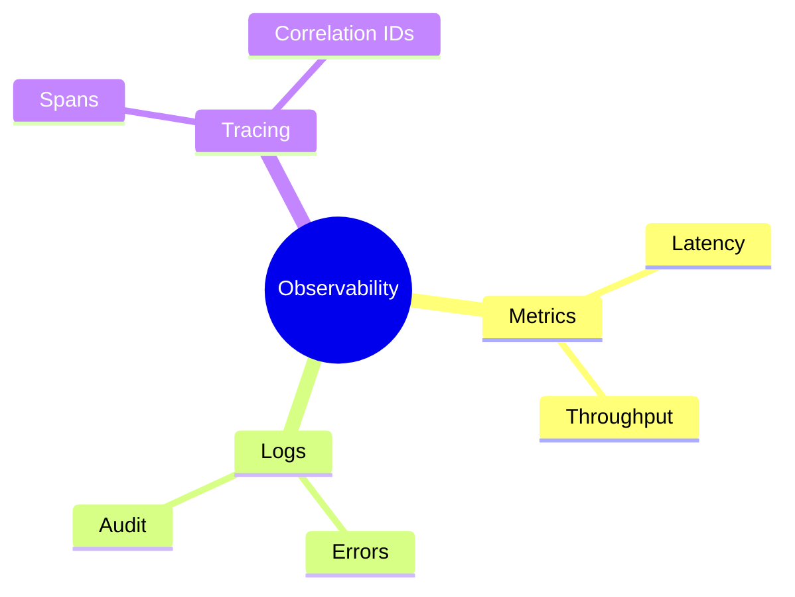
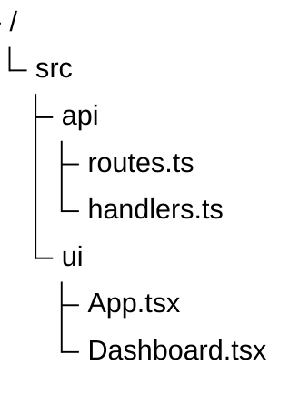
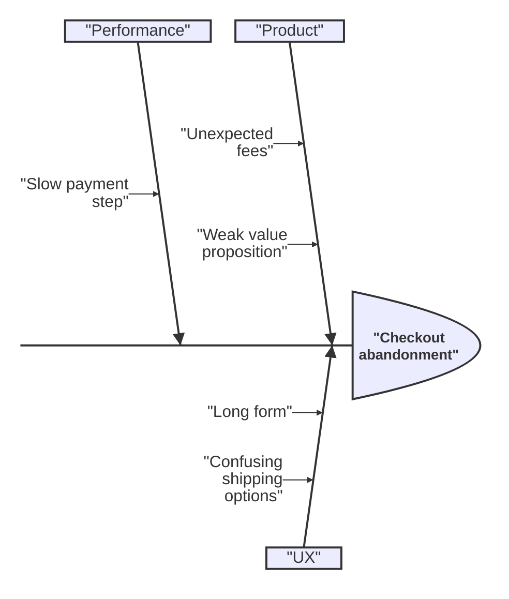

# Structure And Thinking Diagrams

Use these diagrams for hierarchy, brainstorming, and root-cause analysis.

## Mindmap

Use for concept decomposition and brainstorming.

Choose this over flowchart when relationships are hierarchical, not sequential.

## TreeView

Use for directory-like structures or simple parent-child hierarchy display.

Choose this over mindmap when the shape should read like a file tree.

## Ishikawa

Use for root-cause analysis of one problem.

Choose this over mindmap when the central question is causes of a problem.

## Common Mistakes

- Using mindmap for chronological flows
- Using treeView when overlap or cross-links matter
- Using ishikawa without a single clear effect/problem at the head
