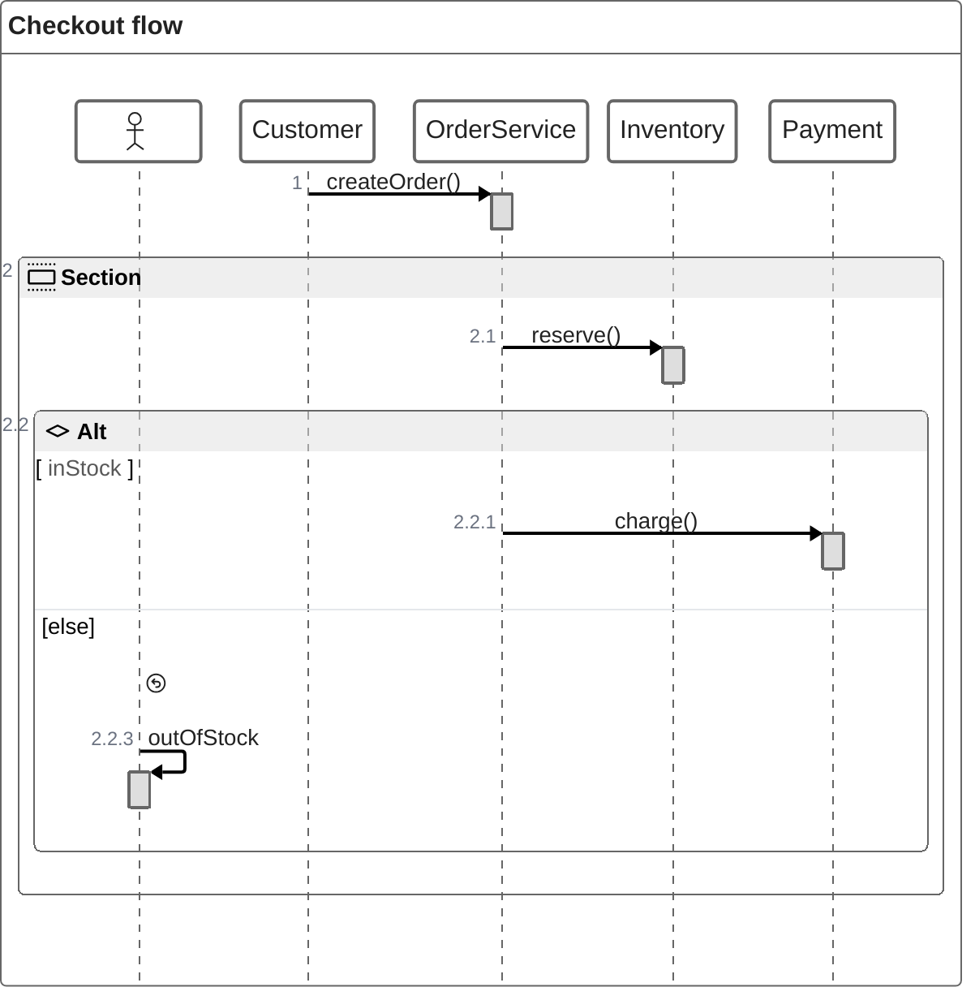
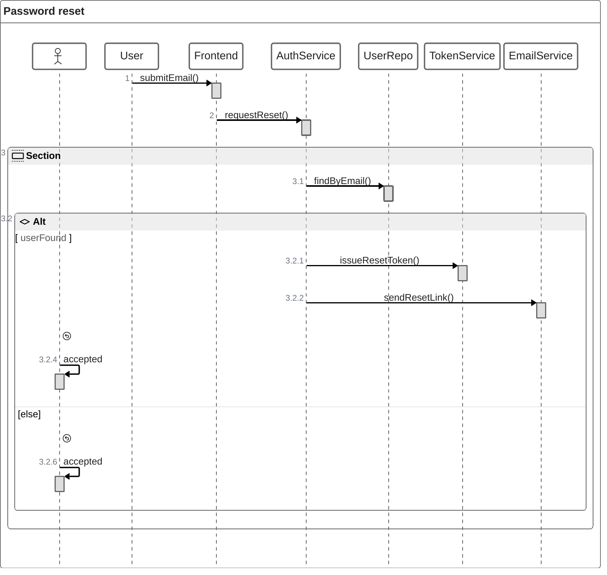

# ZenUML

Use ZenUML when the user describes an interaction as code-like nested calls instead of classic left-to-right message exchange.

## Use It For

- Method-call walkthroughs
- Nested control flow such as `if`, `try`, `for`, `while`
- Object creation and return behavior
- Interaction explanations written in code terms

## Avoid It For

- Simple API request/response flows where `sequenceDiagram` is clearer
- Business workflows better shown as flowcharts
- Broad architecture or participant overviews

## Core Syntax

## Key Patterns

- `A->B.method()` for sync calls
- `A->>B.method()` for async calls
- `new` for object creation
- `@return` for explicit return
- `{}` for nested execution blocks
- `if / else if / else`, `while`, `for`, `par`, `try / catch / finally`

## Example

## Choosing ZenUML vs Sequence Diagram

- Choose **ZenUML** when the user writes or thinks in code.
- Choose **sequenceDiagram** when the audience needs standard UML-like participant flow.

## Common Mistakes

- Using ZenUML for non-code business processes
- Mixing Mermaid sequence syntax into ZenUML
- Over-nesting when a flowchart or state diagram would be simpler
