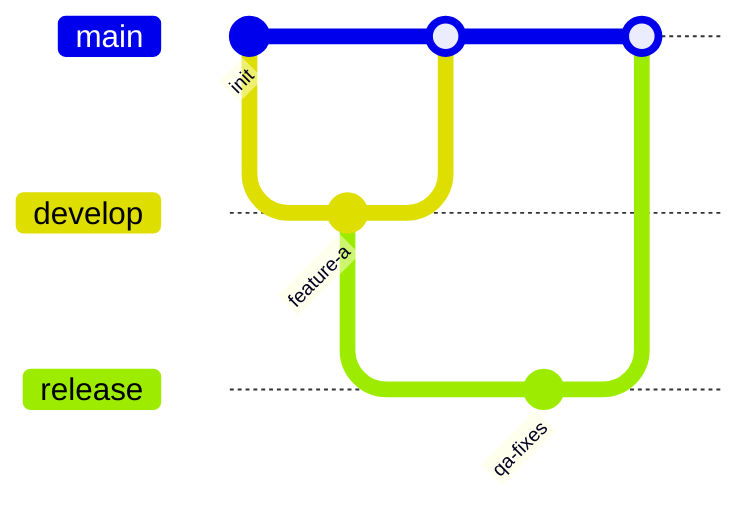
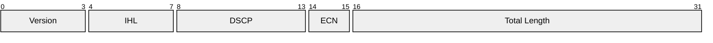

# Engineering And Governance Diagrams

Use these diagrams for traceability, version-control strategy, protocol structure, and high-level system composition.

## Requirement Diagram

Use for SysML-style requirements, traceability, and verification.

```mermaid
requirementDiagram
    functionalRequirement api_latency {
        id: FR-1
        text: API p95 latency must stay below 250ms
        risk: Medium
        verifymethod: Test
    }

    element perf_suite {
        type: test-suite
        docref: perf/api-latency.spec.ts
    }

    perf_suite - verifies -> api_latency
```

Choose this over flowchart when the point is traceability, not behavior.

## GitGraph

Use for branching, releases, and merge strategy.



Choose this over flowchart when the audience needs Git history shape.

## Packet

Use for bit/byte fields in network or binary message layouts.



Use `+<count>` style when iterative editing is easier than absolute ranges.

## Block Diagram

Use for high-level system decomposition without implying runtime order.


Choose this over flowchart when the system is structural, not procedural.

## Common Mistakes

- Using requirement diagrams as a substitute for architecture
- Using gitGraph for generic workflow logic
- Using packet diagrams without exact field widths
- Using block diagrams when state or timing is the actual concern
