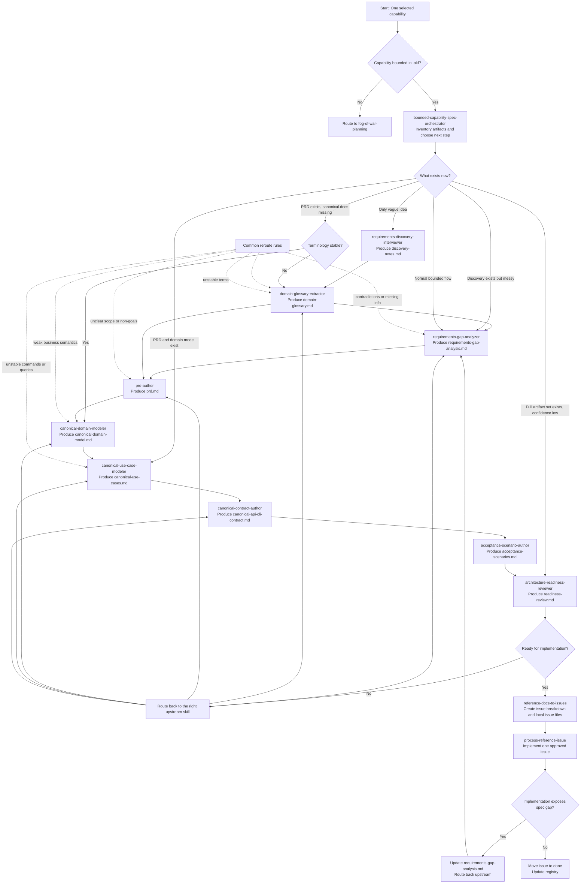

# Architecture Suite Flowchart

## Reading Notes

- The orchestrator is the router, not a replacement for the specialist skills.
- The default build sequence is:
  gap analysis -> glossary -> PRD -> domain -> use cases -> contract ->
  scenarios -> readiness review.
- The flow is intentionally non-linear. Later artifacts can force a return to
  earlier clarification or modeling steps.
- Issue execution is downstream of the full reference-doc pipeline, not a
  parallel shortcut around it.
